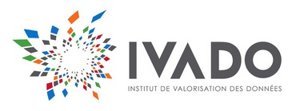

# Leaderboard of the Human Evalutation Round

Rank | BOT | FINAL SCORE | TEAM | Organization
--- | --- | --- | ---| ---
1 |	poetwannabe |	2.386 |	Jan Chorowski, Maciej Pawlikowski, Adrian Lancucki and Pawel Rychlikowski |	University of Wroclaw
2 |	bot#1337 |	2.318 |	Idris Yusupov, Yuri Kuratov |	MIPT
3 |	RLLChatBot |	2.226 |	Michael Noseworthy, Prasanna Parthasarathi, Nicolas Angelard-Gontier, Peter Henderson, Koustuv Sinha, Harsh Satija, Dalan Chen and Joelle Pineau |	McGill University
4 |	kAIb |	2.027 |	Geonmin Kim, Hwaran Lee, Cheong An Lee, Eunmi Hong, Soo-Young Lee |	KAIST, AIBrain, Crossert
5 |	DeepTalkHawk |	1.432 |	David Donahue, Anna Rumshisky, Alexey Romanov, Shufan Wang, Saurabh Kulshreshtha and Renan Campos |	Text Machine, UMass Lowell, Trinity College
6 |	PolyU |	1.284 |	Yanran Li, Hui Su, Wenjie Li and Danlu Chen |	The Hong Kong Polytechnic University, Fudan University

# Partners

## Platinum Partner

## Gold Partner

## Silver Partners

# [Competition home](http://convai.io)
