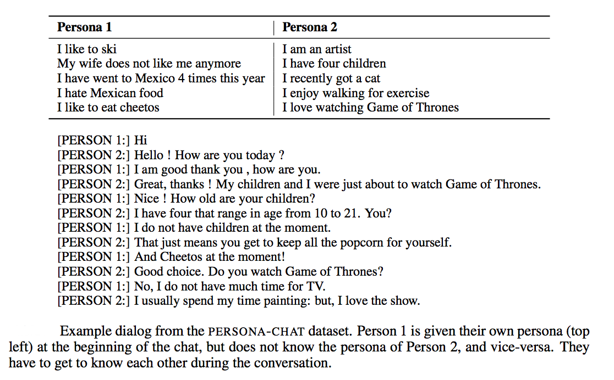

## NIPS 2018 Competition: The Conversational Intelligence Challenge 2 (ConvAI2)


## Overview of the competition

There are currently few datasets appropriate for training and evaluating models for non-goal-oriented dialogue systems (chatbots); and equally problematic, there is currently no standard procedure for evaluating such models beyond the classic Turing test.

The aim of our competition is therefore to establish a concrete scenario for testing chatbots that aim to engage humans, and become a standard evaluation tool in order to make such systems directly comparable.

This is the second Conversational Intelligence (ConvAI) Challenge. The previous one was conducted under the scope of NIPS 2017 Competitions track. This year we aim to improve over last year:
* providing a dataset from the beginning, Persona-Chat
* making the conversations more engaging for humans
* simpler evaluation process (automatic evaluation, followed then by human evaluation)

# PersonaChat ConvAI2 Dataset



Persona-Chat training set consists of conversations between crowdworkers who were randomly paired and asked to act the part of a given provided persona (randomly assigned, and created by another set of crowdworkers). The paired workers were asked to chat naturally and to get to know each other during the conversation. This produces interesting and engaging conversations that learning agents can try to mimic. 

<!-- The Persona-Chat dataset is designed to facilitate research into alleviating some of the issues that traditional chit-chat models face, and with the aim of making such models more consistent and engaging, by endowing them with a persona.
-->

The Persona-Chat task aims to model normal conversation when two interlocutors first meet, and get to know each other. Their aim is to be engaging, to learn about the other's interests, discuss their own interests and find common ground. The task is technically challenging as it involves both asking and answering questions, and maintaining a persistent persona, which is provided. 

Conversing with current chit-chat models for even a short amount of time quickly exposes their weaknesses. Common issues with chit-chat models  include:
* (i) the lack of a consistent personality [(Li et al., 2016)](https://arxiv.org/abs/1603.06155) as they are typically trained over many dialogs each with different speakers,  
* (ii) the lack of an explicit long-term memory as they are typically trained to produce an utterance given only the recent dialogue history [(Vinyals et al., 2015)](https://arxiv.org/abs/1506.05869); and  
* (iii) a tendency to produce non-specific answers like ``I don't know'' [(Li et al., 2015)](https://arxiv.org/abs/1510.03055). 

This competition aims to find models that address  those specific issues. The baseline systems we have already run indicate that there is hope we can make steps in that direction.

The dataset consists of 164,356 utterances in over 10,981 dialogs, some of which are set aside for validation. The speaker pairs each have assigned profiles coming from a set of 1155 possible personas, each consisting of at least 5 profile sentences, setting aside 200 never seen before personas for validation. To avoid modeling that takes advantage of trivial word overlap, we crowdsourced additional rewritten sets of the same personas, with related sentences that are rephrases, generalizations or specializations, rendering the task much more challenging. Evaluation will take place on both types of persona. 

More details can be found in the [paper](https://arxiv.org/abs/1801.07243) describing the dataset.

The competition dataset is available in our open source system [ParlAI](http://parl.ai), more specifically [here](https://github.com/facebookresearch/ParlAI/tree/master/parlai/tasks/convai2).
That is, install ParlAI and then do:
```bash
python examples/display_data.py --task convai2 --datatype train
```
to look at the data.

Source code for baseline methods for the competition are also already provided in [ParlAI](http://parl.ai), including training loop and evaluation code for the automatic evaluation metrics.
Baseline results are provided in the [paper](https://arxiv.org/abs/1801.07243), although the dataset is now larger. (We will hence be running new baselines that will appear on the leaderboard soon.)

As the original test set was released,  we will crowdsource further data for a hidden test set  unseen by the competitors for automatic evaluation. 

# Evaluation

Competitors' models will then be compared in three ways: 
* (i) automated evaluation metrics on a new test set hidden from the competitors; 
* (ii) evaluation on Amazon Mechanical Turk; and 
* (iii) `wild' live evaluation by volunteers having conversations with the bots. 

The winning dialogue systems will be chosen based on these scores. 
Prizes will be awarded!


## Metrics

There are three types of metrics we will evaluate:

* **Automated metrics**  - F1 and hits@k. These  will be computed on the hidden test set. Competitors will provide their code, and we will run the final evaluation (a validation set will be provided for their own local tests).
<!-- Perplexity is only scored for probabilistic generative models, -->
F1 can be computed for any model that produces a response, and hits@k is computed for any model that can rank a set of candidate responses that we provide (either retrieval based models, or generative models capable of assigning a probability to a candidate response). As some methods are not applicable to some metrics, we will have a separate leaderboard for each. The top performing methods for each metric will be evaluated in the live experiments.

* **Amazon Mechanical Turk** - given the entrant's model code, we will run live experiments where Turkers chat to their model given instructions identical to the creation of the original dataset, but with new profiles, and then score its performance. Turkers will score the models between 1-5 with three metrics: fluency, consistency and engagingness. Finally the Turker will try to guess the persona being used by the bot (which was provided) as another measure of the ability of the bot to stick to its given persona. See 
[(Zhang et al., 2018)](https://arxiv.org/abs/1801.07243) for more details of these metrics and collected scores of baseline systems.

* **`Wild' Live Chat with Volunteers** - Finally, we will solicit volunteers to also chat to the models in a similar way to the Mechanical Turk setup. As volunteers, unlike Turkers, are not paid and will likely not follow the instructions as closely, the distribution will likely be different, hence serving as a test of the robustness of the models. This setup will be hosted through the Messenger and Telegram APIs.


## Protocol

We will run live volunteer chat throughout the competition so that competitors can try out their bots talking to humans and to collect live data, if they so wish (however, they are also free to only use the fixed train/test format at this stage).

The automated metrics will be used to obtain a shortlist of best performing systems, likely the top 5 scoring systems from each of the three metrics (F1 and hits@k). If those two leaderboards feature the same models at the top we will take  systems further down the leaderboards, up to a maximum of 10. These systems will be evaluated in the final live experiments on Mechanical Turk and via volunteers using the same scoring protocols, already described.

During NIPS the `wild' live conversation can continue, and the best performing systems will be showcased and conversed with.

We will declare winners in both the automated metrics tracks, and in the live evaluations (which will be considered the grand prize, being more important). The latter will consist of the average of the Turk and wild (volunteer) scores.
Finally, the solutions and any data collected will be made open source to the community.

## Rules

* Competitors should indicate which training sources are used to build their models, and whether (and how) ensembling is used (we may place these in separate tracks in an attempt to deemphasize the use of ensembles).
* Competitors must provide their source code so that the hidden test set evaluation and live experiments can be computed without the team's influence, and so that  the competition has further impact as those models can be released for future research to build off them. Code can be in any language but a thin python wrapper must be provided in order to work with our evaluation and live experiment code.
* We will require that the winning systems also release their training code so that their work is reproducible (although we also encourage that for all systems).
* Competitors are free to augment training with other datasets as long as they are publicly released (and hence, reproducable). Hence, all entrants are expected to work on publicly available data or release the data they use to train. 


## Schedule

Up until September 1st competitors will be able to submit models (source code) to be evaluated on the hidden test set using automated metrics (which we will run on our servers). 

`Wild' live evaluation can also be performed at this time to obtain evaluation metrics and data, although those metrics will not be used for final judgement of the systems, but more for tuning systems if the competitors so wish. 

The current leaderboards will be visible to all competitors.

On September 1st the source code submission system will be locked, and the best performing systems will be evaluated over the next month using Mechanical Turk and the `wild' live evaluation.

Winners will be announced at NIPS 2018.


## Organizing team

The organizing team comes from multiple groups --- Moscow Institute of Physics and Technology, Facebook AI Research, University of Montreal, McGill and Carnegie Mellon University.

The Team consists of: Mikhail Burtsev, Varvara Logacheva, Valentin Malykh, Ryan Lowe, Iulian Serban, Emily Dinan, Douwe Kiela, Alexander Miller, Kurt Shuster, Arthur Szlam, Jack Urbanek and Jason Weston.

Advisory board: Yoshua Bengio, Alan W. Black, Joelle Pineau, Alexander Rudnicky, Jason Williams.
