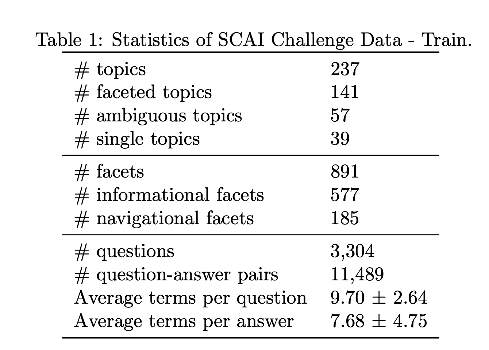

# SCAI Challenge / ConvAI3: Overview of the competition

There are currently few datasets appropriate for training and evaluating models for systems that are neither domain-specific goal-oriented dialogue systems nor chit-chat bots.

The aim of our competition is therefore to establish a concrete scenario for testing conversational systems that aim to satisfy user's information need in a conversational manner.

The goal of the current challenge is to explore the situation of users asking ambigous questions and the systems providing clarifications. Unlike traditional search systems, where the users can browse answers from multiple sources, conversational systems are limited to one answer per user's request. Therefore, a better understanding is needed as to when and how the system should clarify the users' need or help them refine it. Detailed description of the challenge can be found [here](CONVAI3_SCAI_challenge.pdf).

# Registration form

[Please register here](https://docs.google.com/forms/d/e/1FAIpQLSer8lvNvtt-SBwEtqZKjMtPJRWmw5zHUxoNgRJntzBIuVXrmw/viewform).

# Github repo

https://github.com/aliannejadi/ClariQ

# Prize

Stay tuned for the price announcements.

# News 

- June 26, 2020: Announcing the challenge

# Stage 1: Automatic Evaluation Leaderboard (held out test set)

**Validation Leaderboard**  We will also provide an additional validation set leaderboard.

# Stage 2: Human Evaluation Leaderboard 
TBD

#Challenge Design

The challenge will be run in two stages:
  1. **Stage 1:  static dataset** The participants are given a static dataset, similar to [Qulac](https://github.com/aliannejadi/qulac), which they are free to use for training and development purposes. At  the  end  of  the  first  stage  their  systems  are  then  ranked based on a held-out dataset of the same nature.
  2. **Stage  2:   human-in-the-loop** The  TOP-N  systems  from  the  stage  1 are  exposed  to  the  real  users.   Their  responses—answers  and  clarifyingquestions—are rated by the users.

The first stage is essentially a classification and ranking problem.  For a given user query a participating system must decide whether a clarification is neededand, if so, give the best clarifying question.

# Datasets
The competion is run in two stages, each with a unique dataset.

## Stage 1
In Stage 1, we provide to the participants an extended version of the Qulacdataset.  The extension includes:
  - A set of single-faceted queries added to the set of queries, together withpossible clarifying questions and answers on them.
  - The initial queries are in a conversational format.
  - Clarification need labels for each topic.
  - (Optional) Some additional questions and answers.

Dataset statistics:

TODO: finish description

## Stage 2

At that stage the participating systems are put in front of human users. The systems are rated on their overall performance.
At each dialog step, a system should give either a factual answer to the user's query or ask for a clarification.
Therefore, the participants would need to:
  - ensure their system can answer simple user questions
  - make their own decisions on when clarification might be appropriate
  - provide clarification question whenever appropriate
  - interpret user's reply to the clarifying question

The participants would need to strike a balance between asking too many questions
and providing irrelevant answers.

Note that the setup of this stage is quite different from the Stage 1. Participating systems would likely need to operate as a generative model, rather than a retrieval model. One option would be to cast the problem as generative from the beginning, and solve the retrieval part of Stage 1, e.g., by ranking the offered candidates by their likelihood.

Alternatively, one may solve Stage 2 by retrieving a list of candidate answers (e.g., by invoking Wikipedia API or the [Chat Noir](https://www.chatnoir.eu) API that we describe above) and ranking them as in Stage 1.

# Evaluation

Competitors' models will then be compared in three ways: 
* (i) automated evaluation metrics on a new test set hidden from the competitors; 
* (ii) evaluation with crowd workers; and 
* (iii) `wild' live evaluation by volunteers having conversations with the bots. 

The winning dialogue systems will be chosen based on these scores. 

## Metrics

There are three types of metrics we will evaluate:

* **Automated metrics**  - 

* **Crowd workers** - 

* **`Wild' Live Chat with Volunteers** - Finally, we will solicit volunteers to also chat to the models in a similar way to the crowdsourcing setup. As volunteers, unlike crowd workers, are not paid and will likely not follow the instructions as closely, the distribution will likely be different, hence serving as a test of the robustness of the models. This setup will be hosted through the Messenger and Telegram APIs.

## Protocol

TBD

# Rules

* Competitors should indicate which training sources are used to build their models, and whether (and how) ensembling is used (we may place these in separate tracks in an attempt to deemphasize the use of ensembles).
* Competitors must provide their source code so that the hidden test set evaluation and live experiments can be computed without the team's influence, and so that  the competition has further impact as those models can be released for future research to build off them. Code can be in any language but a thin python wrapper must be provided in order to work with our evaluation and live experiment code.
* We will require that the winning systems also release their training code so that their work is reproducible (although we also encourage that for all systems).
* Competitors are free to augment training with other datasets as long as they are publicly released (and hence, reproducible). Hence, all entrants are expected to work on publicly available data or release the data they use to train. 

# Model Submission

TBD

<!---
To submit an entry, create a private repo with your model that works with our evaluation code, and share it with the following github accounts: [varepsilon](https://github.com/varepsilon), [aliannejadi](https://github.com/aliannejadi).

See **SOURCE_TBD** for example baseline submissions.

You are free to use any system (e.g. PyTorch, Tensorflow, C++,..) as long as you can wrap your model for the evaluation. The top level README should tell us your team name, model name, and where the eval_ppl.py, eval_hits.py etc. files are so we can run them. Those should give the numbers on the validation set. Please also include those numbers in the README so we can check we get the same. We will then run the automatic evaluations on the hidden test set and update the leaderboard. You can submit a maximum of once per month.
We will use the same submitted code for the top performing models for computing human evaluations when the submission system is locked on **DATE_TBD**.
-->

# Schedule

Up unti **TBD** competitors will be able to submit models (source code) to be evaluated on the hidden test set using automated metrics (which we will run on our servers). 

Ability to submit a model for evaluation by automatic metrics to be displayed on the leaderboard will be available by **TBD**. The current leaderboards will be visible to all competitors.

`Wild' live evaluation can also be performed at this time to obtain evaluation metrics and data, although those metrics will not be used for final judgement of the systems, but more for tuning systems if the competitors so wish. 

On  **TBD**  the source code submission system will be locked, and the best performing systems will be evaluated over the next month using crowd workers and the `wild' live evaluation.

Winners will be announced at EMNLP 2020.

# Organizing team

- [Mohammad Aliannejadi](http://aliannejadi.com), *University of Amsterdam*, Amsterdam
- [Julia Kiseleva](http://juliakiseleva.com/), *Microsoft Research & AI*, Seattle
- [Jeff Dalton](http://www.dcs.gla.ac.uk/~jeff/), *University of Glasgow*, Glasgow
- [Aleksandr Chuklin](https://www.linkedin.com/in/chuklin/), *Google AI*, Zürich
- [Mikhail Burtsev](https://www.linkedin.com/in/mikhail-burtsev-85a47b9/), *MIPT*, Moscow

# Previous competitions

The challenge is happening together with the Search-oriented Conversational AI workshop at EMNLP 2020 and builds upon the two previously run ConvAI challenges: [ConvAI @ NIPS 2017](http://convai.io/2017) (The Conversational Intelligence Challenge) and [ConvAI2 @ NeurIPS 2018](http://convai.io/2018) (The Persona-Chat Challenge).
