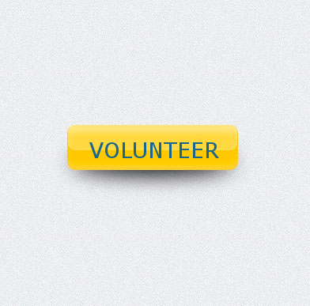

>Dialogue systems and conversational agents -- including chatbots, personal assistants and voice control interfaces -- are becoming increasingly widespread in our daily lives. NIPS is sponsoring an open competition to create a chatbot that can hold an intelligent conversation with a human partner.

## Join our efforts to build an open dataset for the development of the next generation conversational AI

| Participate as a human evaluator volunteer
| :---:
| 

# Leaderboard of the NIPS round

Rank    | BOT    | CURRENT SCORE
--------|--------|-------------
1    | bot#1337    | 2.726
2    | poetwannabe    | 2.538
3    | kAIb    | 2.26
4    | RLLChatBot    | 1.533
5    | DeepTalkHawk    | 1.25
6    | PolyU    | 1.118

* Final scores will be published at 8th of December 2017.

# Workshop at NIPS

[The Conversational Intelligence Challenge section on NIPS 2017 Competition Track Workshop](nips17_wrkshp)

# Press release
[Press release for the Conversational Intelligence Challenge](press_release)

# Leaderboard of the pre-NIPS round

[Leaderboard of the Human Evalutation Round](1_round)

# Dialogue dataset
_Warning!_ Some dialogs cound contain words or language that considered profane, vulgar, or offensive by some readers. The dialogs are partially automatically generated and partially generated by anonymous volunteers, so the organizers of ConvAI are not responsible for dialogs contents. It you have spotted a serious issue, please contact organizers about it by email [info@convai.io](info@convai.io).

[Data collected during the Human Evaluation Round](data)

# Overview of the Competition

Recent advances in machine learning have sparked a renewed interest for dialogue systems in the research community. In addition to the growing real-world applications, the ability to converse is closely related to the overall [goal of AI](http://www.turingarchive.org/browse.php/B/9 "Turing, Alan M. Computing machinery and intelligence. Mind 59.236 (1950): 433-460."). This NIPS Live Competition aims to unify the community around the challenging task: building systems capable of intelligent conversations. Teams are expected to submit dialogue systems able to carry out intelligent and natural conversations about specific news articles with humans. At the final stage of the competition participants, as well as volunteers, will be randomly matched with a bot or a human to chat and evaluate answers of a peer. We expect the competition to have two major outcomes: (1) a measure of quality of state-of-the-art dialogue systems, and (2) an open-source dataset collected from evaluated dialogues.

# Timeline

Date | Milestone
---: | ---
_April, 2017_ | **Registration is open.** Registered teams are allowed to submit applications and solutions for the Qualification Round. 
_**25th of June, 2017**_ | **Qualification Round is closed.**
_**2nd of July, 2017**_  | **Notification of acceptance.**  Teams for the Human Evaluation Round are selected.
_24th-30th of July, 2017_ | **Human Evaluation Round.** One week NLP summer school - [DeepHack Turing](http://turing.deephack.me/). Teams, school participants and volunteers evaluate solutions of qualified teams. Evaluation is done remotely via a messaging platform.
_1st of September, 2017_ | **1st Dataset is published.** Data collected at the Human Evaluation Round is published. Dataset is integrated with the [ParlAI framework](http://parl.ai/) for the efficient training of models. Teams tune their solutions on the 1st Dataset.
_12th of November, 2017_ | **Submission of conversational agents is closed.** Teams submit final solutions for the NIPS Live Competition.
_20th of November - 3rd of December, 2017_ | **Pre-NIPS Human Evaluation.** Teams and volunteers start to evaluate solutions of teams. Evaluation is done remotely via a messaging platform.
_4th-9th of December, 2017_ | **Conversational Intelligence Live Competition at NIPS.** Teams, conference participants and volunteers continue to evaluate solutions of teams. Announcement of winners. 

# Competition Rules

## Competition rounds

The competition consists of four rounds.

1. **Qualification round.** Registered participants submit an application consisting of two parts. (1) Proposal describing details of scientific approach and statement of work including milestones, resources, and other relevant information (up to 1 page and an unlimited number of pages for references), in addition provide a system architecture and relevant technical information (maximum 2 page PDF). (2) Reference to either your submission on [SQuAD](https://rajpurkar.github.io/SQuAD-explorer/) or [MS MARCO](http://www.msmarco.org/) leaderboards, or link to your chatbot for testing. Submission of results is closed on the **_25th of June, 2017_**. Notification of acceptance till **_2nd of July, 2017_**.
2. **Human Evaluation Round.** Members of selected teams are invited to participate in a week long NLP summer school by giving a talk on their research. Participation can be on site or remote. During the school week members of teams, school participants, and volunteers recruited via the competition web page evaluate the submitted dialogue systems on the competition task. At the end of Human Evaluation Round, up to 10 teams are selected for the NIPS Live Competition. Every team is required to evaluate at least 150 dialogues during the Round. Evaluation is done remotely via a messaging platform.
3. **Tuning Round.** Dataset of rated dialogues collected during the Human Evaluation Round is open sourced and can be used by participating teams to tune their solutions. Models can be trained on this dataset via the [ParlAI framework](http://parl.ai/).
4. **NIPS Round.** Starting two weeks before the NIPS conference teams and volunteers perform evaluation of submitted dialogue systems. At the beginning of NIPS the conference participants are invited to volunteer in evaluation of teams’ solutions adjusted over the Tuning Round. Final rating of submissions is presented on the Competition session at NIPS.

## Task

Both human evaluators and dialogue agents complete the same task.

1. Connect randomly with a peer. The peer might be a chat bot or other human user. No information about identity of the peer is provided.
2. Both parties are given a text of a recent news/wikipedia article.
3. Discuss content of the article with the peer as long as you wish.
4. Choose another news/wikipedia article and/or anonymous peer.

## Evaluation

1. Evaluator will not be given any information about identity of the peer.
2. Members of the team will be automatically excluded from evaluation of their own submission and each other.
3. The quality of every response is subjectively evaluated by "thumbs up" & "thumbs down" binary scale. This evaluation could be skipped by evaluator.
4. The quality of the dialog as a whole as well as its breadth and engagement are evaluated on the 0 to 10 range. This evaluation is obligatory.
5. Final rating is calculated as an average of evaluation values accumulated by submitted system during the NIPS Round of Competition.

### Note on diqualification
The submitted system could be excluded from competition temporarily or completely, if there were issues with system used language. We encourage the participants to be guided by common sense, choosing the constraints on system vocabulary. 

If there was a spotted issue the participating system is disqualified from competition temporarily, until the issue is resolved. If issue is not resolved until the competition's end, the system will be disqualified completely from the competition.

## Technical infrastructure

1. Competitors will provide their solutions in the form of executables or source code supporting a [common interface (API)](api).
2. These solutions will be run in isolated virtual environments (containers).
3. The solutions will not be able to access any external services or the Internet, and will only be able to communicate with the supervisor bot to guard against cheating.
4. The master bot will facilitate communication between human evaluators and the competitors’ solutions. It will be available in popular messenger services (Facebook/Telegram). It’s main function will be to connect a participant to a (randomly selected) solution or peer and log the evaluation process.
5. The master bot will provide the instructions and a context necessary for human evaluation of presented solutions.
6. At the NIPS Round models will be able to connect to the master bot via [ParlAI framework](http://parl.ai/).

Also, we are providing [baseline solution](https://github.com/deepmipt/ConvAI-baseline) for participants to start with. More details on dedicated [page](./baseline).

### System requirements
The submitted system will be provided with virtual machine with these constraints:
* 2 virtual processors Intel(R) Xeon(R) CPU E5-2630 v3 @ 2.40GHz
* 16 Gb of RAM
* 50 Gb of disk space

If submitted system would have any issues on running on provided machine, the team would be contacted by organizers to resolve the issue.

## Dataset

Dataset collected during competition will be distributed under Apache 2.0 license.

## Publication of solutions

Participants have to make their systems available open source following the end of the competition, as the goal of the challenge is to enable the community to make sustained progress towards the creation of conversational intelligence. The data used by teams to pretrain models should be made open access or available on request for academic purposes.

# Prizes

10,000 USD for the winning dialogue agent.

We also invite teams to use ParlAI in their solutions and submit applications for [ParlAI request for proposals](https://research.fb.com/programs/research-awards/proposals/parlai/) to $10,000 to $20,000 for academic research.

# Organizers

Mikhail Burtsev, Valentin Malykh, _MIPT, Moscow_

Ryan Lowe, _McGill University, Montreal_

Iulian Serban, Yoshua Bengio, _University of Montreal, Montreal_

Alexander Rudnicky, Alan W. Black, Shrimai Prabhumoye, _Carnegie Mellon University, Pittsburgh_

# Partners

## Platinum Partner

## Gold Partner

## Silver Partners

## Bronze Partner

Please contact info@convai.io for information on sponsorship.

# Contact

Please send your requests to info@convai.io
